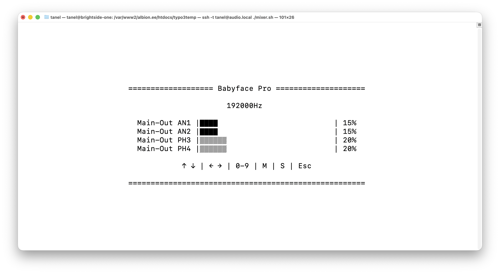

# AlsaMiniMixer

**This is a minimalist, terminal-based audio mixer script for Linux, designed to control the main output volume of a specific ALSA sound card.**

## Key Features:

* Headless Operation: Control your audio without a graphical interface, perfect for systems where a GUI isn't necessary or desired.

* Linked Channel Control: Adjust the volume of all specified output channels simultaneously using a single command.

* Real-time Monitoring: The script displays the current volume levels and the audio sample rate (Hz) of the active stream, with timely updates.

* Simple Controls: Use the left/right arrow keys to fine-tune the volume, or use the number keys (0-9) for quick volume jumps (0% to 90%). You can also toggle mute with the 'M' key.

* Set limit to the maximum volume using % of the maximum hardware volume.

This script is highly configurable, allowing you to easily change the sound card, output channels, and maximum volume limit directly in the code.

## Use it
Just change the config part in the script. Set card number, output channel names, and max volume %. Run it from the terminal ./alsaminimixer.sh

## Why was it created?
I have created this for the personal use to simplify changing hardware volume of the Babyface Pro connected to my Ubuntu media server. It's just a simple shell script and not a full blwon mixer application.

Tested only on Ubuntu with RME Babyface Pro

## Sources
-  [GitHub](https://github.com/t3brightside/pagelist)

## Development
[Brightside OÜ](https://t3brightside.com/)
